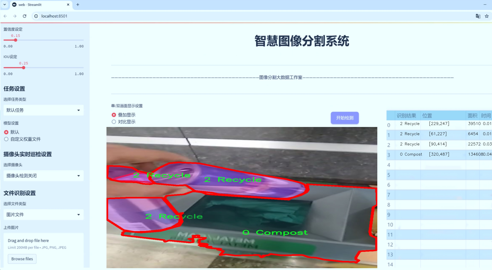
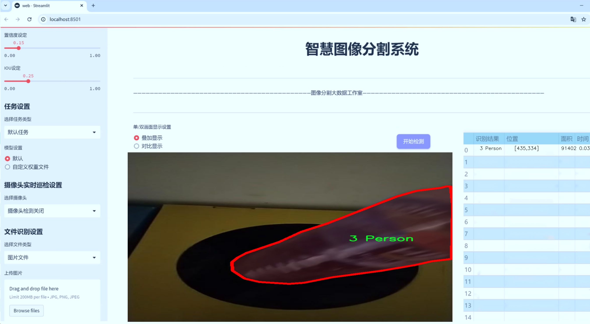
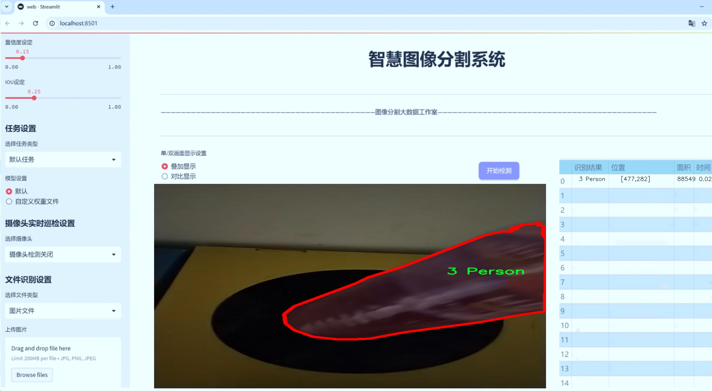
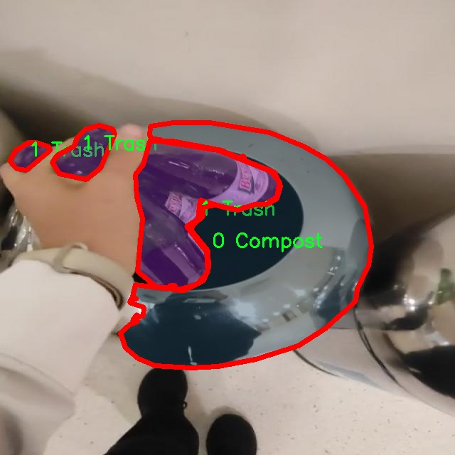
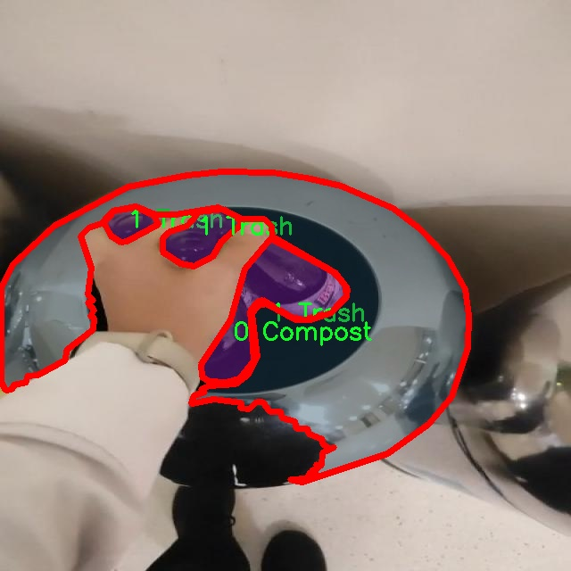
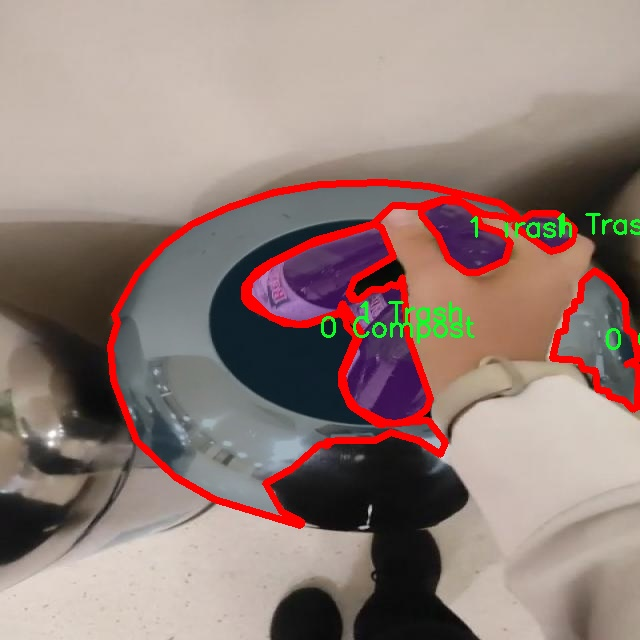
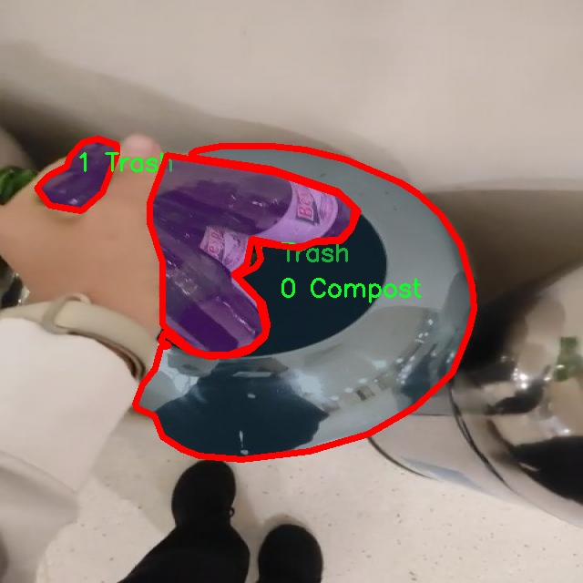

# 垃圾分类图像分割系统源码＆数据集分享
 [yolov8-seg-CSwinTransformer＆yolov8-seg-C2f-EMBC等50+全套改进创新点发刊_一键训练教程_Web前端展示]

### 1.研究背景与意义

项目参考[ILSVRC ImageNet Large Scale Visual Recognition Challenge](https://gitee.com/YOLOv8_YOLOv11_Segmentation_Studio/projects)

项目来源[AAAI Global Al lnnovation Contest](https://kdocs.cn/l/cszuIiCKVNis)

研究背景与意义

随着城市化进程的加快和人口的不断增长，垃圾产生量逐年攀升，垃圾分类作为解决城市环境问题的重要手段，逐渐受到各国政府和社会的广泛关注。有效的垃圾分类不仅可以减少垃圾填埋的压力，还能促进资源的回收利用，降低环境污染。因此，如何提高垃圾分类的准确性和效率，成为了当前研究的热点之一。传统的垃圾分类方法主要依赖人工识别，效率低下且容易出错，难以满足现代城市管理的需求。在此背景下，基于深度学习的图像分割技术逐渐崭露头角，成为实现自动化垃圾分类的重要工具。

YOLO（You Only Look Once）系列模型因其高效的实时目标检测能力而广泛应用于各类计算机视觉任务。YOLOv8作为该系列的最新版本，结合了更为先进的特征提取和目标检测算法，具有更高的准确性和更快的处理速度。通过对YOLOv8进行改进，构建一个专门针对垃圾分类的图像分割系统，将为垃圾分类的自动化提供强有力的技术支持。该系统能够实时识别和分割不同类别的垃圾，从而为后续的分类处理提供准确的数据基础。

本研究所使用的数据集包含2800张图像，涵盖了五个主要类别：堆肥（Compost）、垃圾（Trash）、可回收物（Recycle）、人（Person）以及其他物体（object）。这些类别的划分不仅反映了垃圾分类的基本要求，也为模型的训练提供了丰富的样本数据。通过对这些图像进行实例分割，模型能够在复杂的环境中有效区分不同类别的物体，进而提高垃圾分类的精度和效率。此外，数据集中包含的人类图像信息，可以帮助模型在实际应用中更好地理解人类行为与垃圾分类的关系，进而优化分类策略。

研究的意义不仅在于技术层面的创新，更在于其对社会可持续发展的贡献。通过构建基于改进YOLOv8的垃圾分类图像分割系统，能够为城市垃圾管理提供智能化解决方案，降低人工成本，提高分类效率，进而推动资源的循环利用。此外，该系统的推广应用将有助于提升公众的垃圾分类意识，促进社会各界对环保事业的关注与参与。

综上所述，基于改进YOLOv8的垃圾分类图像分割系统的研究，不仅具有重要的学术价值，也具有广泛的社会应用前景。通过该研究，我们期望能够为未来的垃圾分类技术发展提供新的思路和方法，为实现更为绿色、可持续的城市环境贡献力量。

### 2.图片演示







##### 注意：由于此博客编辑较早，上面“2.图片演示”和“3.视频演示”展示的系统图片或者视频可能为老版本，新版本在老版本的基础上升级如下：（实际效果以升级的新版本为准）

  （1）适配了YOLOV8的“目标检测”模型和“实例分割”模型，通过加载相应的权重（.pt）文件即可自适应加载模型。

  （2）支持“图片识别”、“视频识别”、“摄像头实时识别”三种识别模式。

  （3）支持“图片识别”、“视频识别”、“摄像头实时识别”三种识别结果保存导出，解决手动导出（容易卡顿出现爆内存）存在的问题，识别完自动保存结果并导出到tempDir中。

  （4）支持Web前端系统中的标题、背景图等自定义修改，后面提供修改教程。

  另外本项目提供训练的数据集和训练教程,暂不提供权重文件（best.pt）,需要您按照教程进行训练后实现图片演示和Web前端界面演示的效果。

### 3.视频演示

[3.1 视频演示](https://www.bilibili.com/video/BV13DmAYpEC1/)

### 4.数据集信息展示

##### 4.1 本项目数据集详细数据（类别数＆类别名）

nc: 5
names: ['0 Compost', '1 Trash', '2 Recycle', '3 Person', 'object']


##### 4.2 本项目数据集信息介绍

数据集信息展示

在现代环境保护和资源管理的背景下，垃圾分类的有效性愈发受到重视。为了提升垃圾分类的准确性和效率，研究者们不断探索更为先进的图像分割技术。为此，本研究采用了名为“Compost sorter”的数据集，以训练和改进YOLOv8-seg模型，旨在实现更高效的垃圾分类图像分割系统。

“Compost sorter”数据集包含五个主要类别，分别为“0 Compost”、“1 Trash”、“2 Recycle”、“3 Person”和“object”。这些类别不仅涵盖了常见的垃圾分类元素，还包括了与垃圾分类相关的人物角色，从而为模型提供了丰富的上下文信息。在实际应用中，垃圾分类的有效性不仅依赖于对物品的准确识别，还需要考虑到人类操作的影响。因此，数据集中“3 Person”这一类别的引入，使得模型能够在训练过程中学习到人类与垃圾之间的互动关系，进而提高分类的准确性和实用性。

数据集中的“0 Compost”类别代表可堆肥的有机物，这类物品在垃圾分类中占据重要地位，合理的分类不仅能减少垃圾填埋的压力，还能促进资源的循环利用。“1 Trash”类别则涵盖了不可回收的垃圾，这些物品的准确识别对于减少环境污染至关重要。“2 Recycle”类别则包括了可回收物品，如纸张、塑料和金属等，能够有效地引导资源的再利用，降低对新资源的需求。通过对这三类垃圾的精确分割和识别，模型将能够为垃圾分类提供科学依据，帮助实现更高效的资源管理。

此外，数据集中的“object”类别则是一个通用类别，旨在捕捉那些不易归类的物品。这一类别的存在，能够帮助模型在面对复杂场景时，保持较高的灵活性和适应性。通过对不同类别的综合学习，YOLOv8-seg模型能够在实际应用中实现更为精准的图像分割，进而提高垃圾分类的整体效率。

在数据集的构建过程中，研究者们充分考虑了多样性和代表性，确保每个类别都包含了丰富的样本。这不仅为模型的训练提供了充足的数据支持，也为后续的验证和测试奠定了基础。通过对“Compost sorter”数据集的深入分析和应用，研究者们期望能够显著提升YOLOv8-seg模型在垃圾分类任务中的表现，从而为实现可持续发展的目标贡献力量。

总之，“Compost sorter”数据集为垃圾分类图像分割系统的训练提供了坚实的基础，涵盖了多种垃圾分类的关键元素，并通过引入人类角色的互动，增强了模型的实用性和适应性。随着研究的深入和技术的不断进步，期待该数据集能够在未来的垃圾分类研究中发挥更大的作用，为环境保护和资源管理提供更为有效的解决方案。










### 5.全套项目环境部署视频教程（零基础手把手教学）

[5.1 环境部署教程链接（零基础手把手教学）](https://www.bilibili.com/video/BV1jG4Ve4E9t/?vd_source=bc9aec86d164b67a7004b996143742dc)


[5.2 安装Python虚拟环境创建和依赖库安装视频教程链接（零基础手把手教学）](https://www.bilibili.com/video/BV1nA4VeYEze/?vd_source=bc9aec86d164b67a7004b996143742dc)

### 6.手把手YOLOV8-seg训练视频教程（零基础小白有手就能学会）

[6.1 手把手YOLOV8-seg训练视频教程（零基础小白有手就能学会）](https://www.bilibili.com/video/BV1cA4VeYETe/?vd_source=bc9aec86d164b67a7004b996143742dc)


按照上面的训练视频教程链接加载项目提供的数据集，运行train.py即可开始训练



     Epoch   gpu_mem       box       obj       cls    labels  img_size
     1/200     0G   0.01576   0.01955  0.007536        22      1280: 100%|██████████| 849/849 [14:42<00:00,  1.04s/it]
               Class     Images     Labels          P          R     mAP@.5 mAP@.5:.95: 100%|██████████| 213/213 [01:14<00:00,  2.87it/s]
                 all       3395      17314      0.994      0.957      0.0957      0.0843

     Epoch   gpu_mem       box       obj       cls    labels  img_size
     2/200     0G   0.01578   0.01923  0.007006        22      1280: 100%|██████████| 849/849 [14:44<00:00,  1.04s/it]
               Class     Images     Labels          P          R     mAP@.5 mAP@.5:.95: 100%|██████████| 213/213 [01:12<00:00,  2.95it/s]
                 all       3395      17314      0.996      0.956      0.0957      0.0845

     Epoch   gpu_mem       box       obj       cls    labels  img_size
     3/200     0G   0.01561    0.0191  0.006895        27      1280: 100%|██████████| 849/849 [10:56<00:00,  1.29it/s]
               Class     Images     Labels          P          R     mAP@.5 mAP@.5:.95: 100%|███████   | 187/213 [00:52<00:00,  4.04it/s]
                 all       3395      17314      0.996      0.957      0.0957      0.0845


### 7.50+种全套YOLOV8-seg创新点代码加载调参视频教程（一键加载写好的改进模型的配置文件）

[7.1 50+种全套YOLOV8-seg创新点代码加载调参视频教程（一键加载写好的改进模型的配置文件）](https://www.bilibili.com/video/BV1Hw4VePEXv/?vd_source=bc9aec86d164b67a7004b996143742dc)

### 8.YOLOV8-seg图像分割算法原理

原始YOLOv8-seg算法原理

YOLOv8-seg算法是2023年由Ultralytics推出的一款前沿目标检测与分割模型，它在YOLO系列的基础上进行了深度的创新与优化，旨在为实时检测任务提供更高的精度和速度。YOLOv8的设计理念吸收了YOLOv1至YOLOv7的众多优点，尤其是在Head标签分配和Loss计算方面，YOLOv8与PP-YOLOE有着显著的相似性。这种融合不仅提升了模型的性能，也为目标检测领域带来了新的冲击。

YOLOv8的网络结构主要由三个核心部分组成：主干网络（backbone）、特征增强网络（neck）和检测头（head）。在主干网络方面，YOLOv8依然采用了CSP（Cross Stage Partial）网络结构，这种设计能够有效提高特征提取的效率，减少计算量，同时保持较高的检测精度。CSP网络通过将特征图分成两部分，分别进行处理，然后再合并，能够有效缓解梯度消失的问题，提升模型的训练效果。

特征增强网络采用了PAN-FPN（Path Aggregation Network - Feature Pyramid Network）的设计理念。PAN-FPN通过不同层次的特征融合，增强了模型对多尺度目标的检测能力。这种结构使得YOLOv8能够在处理不同大小和形状的目标时，保持较高的准确性和鲁棒性。通过对特征图的有效聚合，YOLOv8能够更好地捕捉到目标的上下文信息，从而提高分割和检测的精度。

在检测头部分，YOLOv8引入了解耦头的概念，将目标的分类和回归任务分为两个独立的分支。这种解耦设计使得每个任务可以更加专注于自身的目标，避免了以往耦合头中可能出现的任务干扰问题。这一创新显著提升了模型在复杂场景下的定位精度和分类准确性，使得YOLOv8在实际应用中表现更加出色。

值得一提的是，YOLOv8采用了Anchor-free目标检测方法，这一方法是基于回归的目标检测策略，摒弃了传统的锚点框概念。传统方法中，锚点框的选择和调整往往繁琐且不够灵活，尤其是在处理不同尺度和形状的目标时，锚点框的设定可能会导致检测效果不佳。而YOLOv8通过直接预测目标的位置和大小，网络能够更快地聚焦于目标位置的邻近点，使得预测框更接近于实际的边界框区域。这种Anchor-free设计不仅简化了模型的训练过程，也提升了检测的效率。

YOLOv8-seg在目标分割方面的能力也得到了显著增强。通过结合深度学习中的语义分割技术，YOLOv8-seg能够对目标进行精确的像素级分割。这一特性在农业、自动驾驶等领域具有广泛的应用潜力。例如，在苹果采摘的场景中，YOLOv8-seg可以自动识别和定位苹果的位置，并进行精确的分割，从而为自动采摘机器人提供准确的目标信息。这种高效的视觉识别能力，不仅提升了自动化采摘的效率，也为农业生产带来了新的可能性。

在实际应用中，YOLOv8-seg的实时检测能力使其能够快速响应动态环境中的变化，适应各种复杂的场景。这一特性使得YOLOv8-seg在许多实时应用中表现优异，如监控、无人驾驶、机器人视觉等。结合蚁群算法进行路径规划，能够进一步提升自动采摘机器人的工作效率，使其在果园中能够快速、准确地完成采摘任务。

总的来说，YOLOv8-seg算法通过其创新的网络结构和高效的目标检测与分割能力，为目标检测领域带来了新的发展机遇。其在实时性、精度和灵活性上的优势，使得YOLOv8-seg成为了一个极具潜力的工具，能够在各个应用场景中发挥重要作用。随着技术的不断进步，YOLOv8-seg有望在未来的研究和应用中继续推动目标检测与分割技术的发展，为各行各业提供更为智能化的解决方案。


### 9.系统功能展示（检测对象为举例，实际内容以本项目数据集为准）

图9.1.系统支持检测结果表格显示

  图9.2.系统支持置信度和IOU阈值手动调节

  图9.3.系统支持自定义加载权重文件best.pt(需要你通过步骤5中训练获得)

  图9.4.系统支持摄像头实时识别

  图9.5.系统支持图片识别

  图9.6.系统支持视频识别

  图9.7.系统支持识别结果文件自动保存

  图9.8.系统支持Excel导出检测结果数据


### 10.50+种全套YOLOV8-seg创新点原理讲解（非科班也可以轻松写刊发刊，V11版本正在科研待更新）

#### 10.1 由于篇幅限制，每个创新点的具体原理讲解就不一一展开，具体见下列网址中的创新点对应子项目的技术原理博客网址【Blog】：


[10.1 50+种全套YOLOV8-seg创新点原理讲解链接](https://gitee.com/qunmasj/good)

#### 10.2 部分改进模块原理讲解(完整的改进原理见上图和技术博客链接)【如果此小节的图加载失败可以通过CSDN或者Github搜索该博客的标题访问原始博客，原始博客图片显示正常】
### FasterNet简介
神经网络在图像分类、检测和分割等各种计算机视觉任务中经历了快速发展。尽管其令人印象深刻的性能为许多应用程序提供了动力，但一个巨大的趋势是追求具有低延迟和高吞吐量的快速神经网络，以获得良好的用户体验、即时响应和安全原因等。

如何快速？研究人员和从业者不需要更昂贵的计算设备，而是倾向于设计具有成本效益的快速神经网络，降低计算复杂度，主要以浮点运算（FLOPs）的数量来衡量。

MobileNet、ShuffleNet和GhostNet等利用深度卷积（DWConv）和/或组卷积（GConv）来提取空间特征。然而，在减少FLOPs的过程中，算子经常会受到内存访问增加的副作用的影响。MicroNet进一步分解和稀疏网络，将其FLOPs推至极低水平。尽管这种方法在FLOPs方面有所改进，但其碎片计算效率很低。此外，上述网络通常伴随着额外的数据操作，如级联、Shuffle和池化，这些操作的运行时间对于小型模型来说往往很重要。

除了上述纯卷积神经网络（CNNs）之外，人们对使视觉Transformer（ViTs）和多层感知器（MLP）架构更小更快也越来越感兴趣。例如，MobileViT和MobileFormer通过将DWConv与改进的注意力机制相结合，降低了计算复杂性。然而，它们仍然受到DWConv的上述问题的困扰，并且还需要修改的注意力机制的专用硬件支持。使用先进但耗时的标准化和激活层也可能限制其在设备上的速度。

所有这些问题一起导致了以下问题：这些“快速”的神经网络真的很快吗？为了回答这个问题，作者检查了延迟和FLOPs之间的关系，这由


其中FLOPS是每秒浮点运算的缩写，作为有效计算速度的度量。虽然有许多减少FLOPs的尝试，但都很少考虑同时优化FLOPs以实现真正的低延迟。为了更好地理解这种情况，作者比较了Intel CPU上典型神经网络的FLOPS。


图中的结果表明，许多现有神经网络的FLOPS较低，其FLOPS通常低于流行的ResNet50。由于FLOPS如此之低，这些“快速”的神经网络实际上不够快。它们的FLOPs减少不能转化为延迟的确切减少量。在某些情况下，没有任何改善，甚至会导致更糟的延迟。例如，CycleMLP-B1具有ResNet50的一半FLOPs，但运行速度较慢（即CycleMLPB1与ResNet50:111.9ms与69.4ms）。

请注意，FLOPs与延迟之间的差异在之前的工作中也已被注意到，但由于它们采用了DWConv/GConv和具有低FLOPs的各种数据处理，因此部分问题仍未解决。人们认为没有更好的选择。

该博客提供的方案通过开发一种简单、快速、有效的运算符来消除这种差异，该运算符可以在减少FLOPs的情况下保持高FLOPS。

具体来说，作者重新审视了现有的操作符，特别是DWConv的计算速度——FLOPS。作者发现导致低FLOPS问题的主要原因是频繁的内存访问。然后，作者提出了PConv作为一种竞争性替代方案，它减少了计算冗余以及内存访问的数量。

图1说明了PConv的设计。它利用了特征图中的冗余，并系统地仅在一部分输入通道上应用规则卷积（Conv），而不影响其余通道。本质上，PConv的FLOPs低于常规Conv，而FLOPs高于DWConv/GConv。换句话说，PConv更好地利用了设备上的计算能力。PConv在提取空间特征方面也很有效，这在本文后面的实验中得到了验证。

作者进一步引入PConv设计了FasterNet作为一个在各种设备上运行速度非常快的新网络家族。特别是，FasterNet在分类、检测和分割任务方面实现了最先进的性能，同时具有更低的延迟和更高的吞吐量。例如，在GPU、CPU和ARM处理器上，小模型FasterNet-T0分别比MobileVitXXS快3.1倍、3.1倍和2.5倍，而在ImageNet-1k上的准确率高2.9%。大模型FasterNet-L实现了83.5%的Top-1精度，与Swin-B不相上下，同时在GPU上提供了49%的高吞吐量，在CPU上节省了42%的计算时间。

总之，贡献如下：

指出了实现更高FLOPS的重要性，而不仅仅是为了更快的神经网络而减少FLOPs。

引入了一种简单但快速且有效的卷积PConv，它很有可能取代现有的选择DWConv。

推出FasterNet，它在GPU、CPU和ARM处理器等多种设备上运行良好且普遍快速。

对各种任务进行了广泛的实验，并验证了PConv和FasterNet的高速性和有效性。

### Conv和FasterNet的设计
#### 原理

DWConv是Conv的一种流行变体，已被广泛用作许多神经网络的关键构建块。对于输入，DWConv应用个滤波器来计算输出。如图（b）所示，每个滤波器在一个输入通道上进行空间滑动，并对一个输出通道做出贡献。

与具有的FLOPs常规Conv相比，这种深度计算使得DWConv仅仅具有的FLOPs。虽然在减少FLOPs方面有效，但DWConv（通常后跟逐点卷积或PWConv）不能简单地用于替换常规Conv，因为它会导致严重的精度下降。因此，在实践中，DWConv的通道数（或网络宽度）增加到＞以补偿精度下降，例如，倒置残差块中的DWConv宽度扩展了6倍。然而，这会导致更高的内存访问，这会造成不可忽略的延迟，并降低总体计算速度，尤其是对于I/O绑定设备。特别是，内存访问的数量现在上升到


它比一个常规的Conv的值要高，即，


注意，内存访问花费在I/O操作上，这被认为已经是最小的成本，很难进一步优化。

#### PConv作为一个基本的算子


在下面演示了通过利用特征图的冗余度可以进一步优化成本。如图所示，特征图在不同通道之间具有高度相似性。许多其他著作也涵盖了这种冗余，但很少有人以简单而有效的方式充分利用它。


具体而言，作者提出了一种简单的PConv，以同时减少计算冗余和内存访问。图4中的左下角说明了PConv的工作原理。它只需在输入通道的一部分上应用常规Conv进行空间特征提取，并保持其余通道不变。对于连续或规则的内存访问，将第一个或最后一个连续的通道视为整个特征图的代表进行计算。在不丧失一般性的情况下认为输入和输出特征图具有相同数量的通道。因此，PConv的FLOPs仅


对于典型的r＝1/4 ，PConv的FLOPs只有常规Conv的1/16。此外，PConv的内存访问量较小，即：


对于r＝1/4，其仅为常规Conv的1/4。

由于只有通道用于空间特征提取，人们可能会问是否可以简单地移除剩余的（c−）通道？如果是这样，PConv将退化为具有较少通道的常规Conv，这偏离了减少冗余的目标。

请注意，保持其余通道不变，而不是从特征图中删除它们。这是因为它们对后续PWConv层有用，PWConv允许特征信息流经所有通道。

#### PConv之后是PWConv


为了充分有效地利用来自所有通道的信息，进一步将逐点卷积（PWConv）附加到PConv。它们在输入特征图上的有效感受野看起来像一个T形Conv，与均匀处理补丁的常规Conv相比，它更专注于中心位置，如图5所示。为了证明这个T形感受野的合理性，首先通过计算位置的Frobenius范数来评估每个位置的重要性。


假设，如果一个职位比其他职位具有更大的Frobenius范数，则该职位往往更重要。对于正则Conv滤波器，位置处的Frobenius范数由计算，其中。


一个显著位置是具有最大Frobenius范数的位置。然后，在预训练的ResNet18中集体检查每个过滤器，找出它们的显著位置，并绘制显著位置的直方图。图6中的结果表明，中心位置是过滤器中最常见的突出位置。换句话说，中心位置的权重比周围的更重。这与集中于中心位置的T形计算一致。

虽然T形卷积可以直接用于高效计算，但作者表明，将T形卷积分解为PConv和PWConv更好，因为该分解利用了滤波器间冗余并进一步节省了FLOPs。对于相同的输入和输出，T形Conv的FLOPs可以计算为:


它高于PConv和PWConv的流量，即：


其中和（例如，当时）。此外，可以很容易地利用常规Conv进行两步实现。

# FasterNet作为Backbone
鉴于新型PConv和现成的PWConv作为主要的算子，进一步提出FasterNet，这是一个新的神经网络家族，运行速度非常快，对许多视觉任务非常有效。目标是使体系结构尽可能简单，使其总体上对硬件友好。


在图中展示了整体架构。它有4个层次级，每个层次级前面都有一个嵌入层（步长为4的常规4×4卷积）或一个合并层（步长为2的常规2×2卷积），用于空间下采样和通道数量扩展。每个阶段都有一堆FasterNet块。作者观察到，最后两个阶段中的块消耗更少的内存访问，并且倾向于具有更高的FLOPS，如表1中的经验验证。因此，放置了更多FasterNet块，并相应地将更多计算分配给最后两个阶段。每个FasterNet块有一个PConv层，后跟2个PWConv（或Conv 1×1）层。它们一起显示为倒置残差块，其中中间层具有扩展的通道数量，并且放置了Shorcut以重用输入特征。

除了上述算子，标准化和激活层对于高性能神经网络也是不可或缺的。然而，许多先前的工作在整个网络中过度使用这些层，这可能会限制特征多样性，从而损害性能。它还可以降低整体计算速度。相比之下，只将它们放在每个中间PWConv之后，以保持特征多样性并实现较低的延迟。

此外，使用批次归一化（BN）代替其他替代方法。BN的优点是，它可以合并到其相邻的Conv层中，以便更快地进行推断，同时与其他层一样有效。对于激活层，根据经验选择了GELU用于较小的FasterNet变体，而ReLU用于较大的FasterNet变体，同时考虑了运行时间和有效性。最后三个层，即全局平均池化、卷积1×1和全连接层，一起用于特征转换和分类。

为了在不同的计算预算下提供广泛的应用，提供FasterNet的Tiny模型、Small模型、Medium模型和Big模型变体，分别称为FasterNetT0/1/2、FasterNet-S、FasterNet-M和FasterNet-L。它们具有相似的结构，但深度和宽度不同。

架构规范如下：


### 11.项目核心源码讲解（再也不用担心看不懂代码逻辑）

#### 11.1 ultralytics\nn\backbone\repvit.py

以下是经过精简和注释的核心代码部分，保留了主要的模型结构和功能，同时提供了详细的中文注释：

```python
import torch
import torch.nn as nn
from timm.models.layers import SqueezeExcite

def _make_divisible(v, divisor, min_value=None):
    """
    确保所有层的通道数是8的倍数
    :param v: 输入通道数
    :param divisor: 除数
    :param min_value: 最小值
    :return: 可被divisor整除的通道数
    """
    if min_value is None:
        min_value = divisor
    new_v = max(min_value, int(v + divisor / 2) // divisor * divisor)
    if new_v < 0.9 * v:
        new_v += divisor
    return new_v

class Conv2d_BN(nn.Sequential):
    """
    包含卷积层和批归一化层的组合
    """
    def __init__(self, in_channels, out_channels, kernel_size=1, stride=1, padding=0, dilation=1, groups=1):
        super().__init__()
        self.add_module('conv', nn.Conv2d(in_channels, out_channels, kernel_size, stride, padding, dilation, groups, bias=False))
        self.add_module('bn', nn.BatchNorm2d(out_channels))

    @torch.no_grad()
    def fuse_self(self):
        """
        融合卷积层和批归一化层为单个卷积层
        """
        conv, bn = self._modules.values()
        w = bn.weight / (bn.running_var + bn.eps)**0.5
        w = conv.weight * w[:, None, None, None]
        b = bn.bias - bn.running_mean * bn.weight / (bn.running_var + bn.eps)**0.5
        fused_conv = nn.Conv2d(w.size(1) * conv.groups, w.size(0), w.shape[2:], stride=conv.stride, padding=conv.padding, dilation=conv.dilation, groups=conv.groups)
        fused_conv.weight.data.copy_(w)
        fused_conv.bias.data.copy_(b)
        return fused_conv

class RepViTBlock(nn.Module):
    """
    RepViT块，包含通道混合和标记混合
    """
    def __init__(self, inp, hidden_dim, oup, kernel_size, stride, use_se, use_hs):
        super(RepViTBlock, self).__init__()
        self.identity = stride == 1 and inp == oup

        if stride == 2:
            self.token_mixer = nn.Sequential(
                Conv2d_BN(inp, inp, kernel_size, stride, (kernel_size - 1) // 2, groups=inp),
                SqueezeExcite(inp, 0.25) if use_se else nn.Identity(),
                Conv2d_BN(inp, oup, ks=1, stride=1, pad=0)
            )
            self.channel_mixer = nn.Sequential(
                Conv2d_BN(oup, 2 * oup, 1, 1, 0),
                nn.GELU() if use_hs else nn.Identity(),
                Conv2d_BN(2 * oup, oup, 1, 1, 0)
            )
        else:
            assert self.identity
            self.token_mixer = nn.Sequential(
                Conv2d_BN(inp, inp, 3, 1, 1, groups=inp),
                SqueezeExcite(inp, 0.25) if use_se else nn.Identity(),
            )
            self.channel_mixer = nn.Sequential(
                Conv2d_BN(inp, hidden_dim, 1, 1, 0),
                nn.GELU() if use_hs else nn.Identity(),
                Conv2d_BN(hidden_dim, oup, 1, 1, 0)
            )

    def forward(self, x):
        return self.channel_mixer(self.token_mixer(x))

class RepViT(nn.Module):
    """
    RepViT模型
    """
    def __init__(self, cfgs):
        super(RepViT, self).__init__()
        self.cfgs = cfgs
        input_channel = self.cfgs[0][2]
        layers = [Conv2d_BN(3, input_channel // 2, 3, 2, 1), nn.GELU(), Conv2d_BN(input_channel // 2, input_channel, 3, 2, 1)]
        
        for k, t, c, use_se, use_hs, s in self.cfgs:
            output_channel = _make_divisible(c, 8)
            exp_size = _make_divisible(input_channel * t, 8)
            layers.append(RepViTBlock(input_channel, exp_size, output_channel, k, s, use_se, use_hs))
            input_channel = output_channel
            
        self.features = nn.ModuleList(layers)

    def forward(self, x):
        for f in self.features:
            x = f(x)
        return x

def repvit_m2_3(weights=''):
    """
    构建RepViT模型的一个实例
    """
    cfgs = [
        [3, 2, 80, 1, 0, 1],
        [3, 2, 80, 0, 0, 1],
        # ... 省略其他配置
        [3, 2, 640, 0, 1, 1],
    ]
    model = RepViT(cfgs)
    if weights:
        model.load_state_dict(torch.load(weights)['model'])
    return model

if __name__ == '__main__':
    model = repvit_m2_3('repvit_m2_3_distill_450e.pth')
    inputs = torch.randn((1, 3, 640, 640))
    res = model(inputs)
    for i in res:
        print(i.size())
```

### 代码说明：
1. **_make_divisible**: 确保通道数是8的倍数，以便在模型中保持一致性。
2. **Conv2d_BN**: 组合卷积层和批归一化层，并提供融合功能。
3. **RepViTBlock**: 代表一个RepViT模块，包含通道混合和标记混合的结构。
4. **RepViT**: 整个RepViT模型，使用配置构建多个RepViT块。
5. **repvit_m2_3**: 构建RepViT模型的特定实例，并加载权重。

### 注意：
- 省略了部分配置和方法以简化代码。
- 代码中的权重加载和其他细节可以根据需要进行扩展。

这个文件实现了一个名为 RepViT 的神经网络模型，主要用于计算机视觉任务。该模型的结构和功能可以分为几个部分。

首先，文件导入了必要的库，包括 PyTorch 的神经网络模块（torch.nn）、NumPy 以及来自 timm 库的 SqueezeExcite 层。接着，定义了一个 `__all__` 列表，列出了可以从该模块导入的模型名称。

接下来，定义了一个 `replace_batchnorm` 函数，用于将网络中的 BatchNorm2d 层替换为 Identity 层，以便在推理时减少计算量和内存使用。这个函数会递归遍历网络的所有子模块，进行相应的替换。

然后，定义了一个 `_make_divisible` 函数，该函数确保所有层的通道数都是可被 8 整除的，以满足特定的硬件要求。

接着，定义了 `Conv2d_BN` 类，这是一个组合了卷积层和批归一化层的模块。它的构造函数初始化了卷积层和批归一化层，并对批归一化层的权重进行了初始化。这个类还包含一个 `fuse_self` 方法，用于将卷积层和批归一化层融合为一个卷积层，以提高推理速度。

接下来是 `Residual` 类，它实现了残差连接。该类在前向传播时会将输入与经过卷积层处理后的输出相加，并根据训练状态和丢弃率决定是否添加噪声。它同样包含一个 `fuse_self` 方法，用于融合卷积层。

`RepVGGDW` 类是一个特殊的卷积模块，结合了深度可分离卷积和残差连接。它在前向传播中执行深度可分离卷积和一个 1x1 卷积，并通过批归一化层进行处理。

`RepViTBlock` 类是 RepViT 模型的基本构建块。它根据步幅和输入输出通道的关系，构建了不同的卷积和激活层组合。该类的前向传播方法将输入通过 token mixer 和 channel mixer 进行处理。

`RepViT` 类是整个模型的核心，负责构建网络的结构。它根据配置列表 `cfgs` 来构建不同的层，并在前向传播中提取特征。该类还包含一个 `switch_to_deploy` 方法，用于将网络切换到推理模式，执行 BatchNorm 的替换。

此外，文件中还定义了一个 `update_weight` 函数，用于更新模型的权重。这个函数会将预训练权重加载到模型中，并确保权重的形状匹配。

最后，文件定义了多个函数（如 `repvit_m0_9`、`repvit_m1_0` 等），用于构建不同版本的 RepViT 模型。这些函数根据特定的配置构建模型，并可选择性地加载预训练权重。

在文件的最后部分，如果该文件作为主程序运行，则会实例化一个 `repvit_m2_3` 模型，并对一个随机输入进行前向传播，输出各层的特征图大小。这个部分用于测试模型的构建和前向传播是否正常。

#### 11.2 ui.py

```python
import sys
import subprocess

def run_script(script_path):
    """
    使用当前 Python 环境运行指定的脚本。

    Args:
        script_path (str): 要运行的脚本路径

    Returns:
        None
    """
    # 获取当前 Python 解释器的路径
    python_path = sys.executable

    # 构建运行命令
    command = f'"{python_path}" -m streamlit run "{script_path}"'

    # 执行命令
    result = subprocess.run(command, shell=True)
    if result.returncode != 0:
        print("脚本运行出错。")


# 实例化并运行应用
if __name__ == "__main__":
    # 指定您的脚本路径
    script_path = "web.py"  # 这里可以直接指定脚本路径

    # 运行脚本
    run_script(script_path)
```

### 代码核心部分及注释：

1. **导入模块**：
   ```python
   import sys
   import subprocess
   ```
   - `sys`模块用于访问与Python解释器紧密相关的变量和函数，例如获取当前Python解释器的路径。
   - `subprocess`模块用于创建新进程、连接到它们的输入/输出/错误管道，并获取返回码。

2. **定义函数 `run_script`**：
   ```python
   def run_script(script_path):
   ```
   - 该函数接收一个参数 `script_path`，表示要运行的Python脚本的路径。

3. **获取当前Python解释器路径**：
   ```python
   python_path = sys.executable
   ```
   - 使用 `sys.executable` 获取当前Python解释器的完整路径，以便在命令中调用。

4. **构建运行命令**：
   ```python
   command = f'"{python_path}" -m streamlit run "{script_path}"'
   ```
   - 使用格式化字符串构建运行命令，`-m streamlit run`用于通过Streamlit运行指定的脚本。

5. **执行命令**：
   ```python
   result = subprocess.run(command, shell=True)
   ```
   - 使用 `subprocess.run` 执行构建的命令，`shell=True`表示在shell中执行命令。

6. **检查命令执行结果**：
   ```python
   if result.returncode != 0:
       print("脚本运行出错。")
   ```
   - 检查命令的返回码，如果不为0，表示脚本运行出错，打印错误信息。

7. **主程序入口**：
   ```python
   if __name__ == "__main__":
   ```
   - 这部分代码确保只有在直接运行该脚本时才会执行以下代码，而在被导入时不会执行。

8. **指定脚本路径并运行**：
   ```python
   script_path = "web.py"  # 这里可以直接指定脚本路径
   run_script(script_path)
   ```
   - 指定要运行的脚本路径，并调用 `run_script` 函数执行该脚本。

这个程序文件名为 `ui.py`，其主要功能是通过当前的 Python 环境运行一个指定的脚本。代码首先导入了必要的模块，包括 `sys`、`os` 和 `subprocess`，以及一个自定义的路径处理模块 `abs_path`。

在 `run_script` 函数中，程序接受一个参数 `script_path`，这是要运行的脚本的路径。函数首先获取当前 Python 解释器的路径，这样可以确保在正确的环境中执行脚本。接着，构建一个命令字符串，该命令使用 `streamlit` 模块来运行指定的脚本。`subprocess.run` 函数被用来执行这个命令，`shell=True` 参数允许在 shell 中执行命令。

如果脚本运行过程中出现错误，`result.returncode` 将不等于 0，程序会打印出“脚本运行出错”的提示信息。

在文件的最后部分，使用 `if __name__ == "__main__":` 语句来确保当该文件作为主程序运行时才会执行下面的代码。这里指定了要运行的脚本路径为 `web.py`，并调用 `run_script` 函数来执行这个脚本。

总体来说，这个程序的目的是提供一个简单的接口来运行指定的 Python 脚本，特别是用于运行 Streamlit 应用。

#### 11.3 ultralytics\models\nas\__init__.py

以下是代码中最核心的部分，并附上详细的中文注释：

```python
# 导入所需的模块和类
from .model import NAS  # 从当前包的model模块中导入NAS类
from .predict import NASPredictor  # 从当前包的predict模块中导入NASPredictor类
from .val import NASValidator  # 从当前包的val模块中导入NASValidator类

# 定义当前模块的公开接口
__all__ = 'NASPredictor', 'NASValidator', 'NAS'  # 指定在使用from module import *时，公开的类和函数
```

### 注释说明：
1. **导入模块**：
   - `from .model import NAS`：从当前包的`model`模块中导入`NAS`类，`NAS`可能是一个与神经架构搜索（Neural Architecture Search）相关的模型。
   - `from .predict import NASPredictor`：从当前包的`predict`模块中导入`NASPredictor`类，`NASPredictor`可能用于对输入数据进行预测。
   - `from .val import NASValidator`：从当前包的`val`模块中导入`NASValidator`类，`NASValidator`可能用于验证模型的性能。

2. **定义公开接口**：
   - `__all__`：这是一个特殊变量，用于定义当前模块的公共接口。当使用`from module import *`时，只会导入`__all__`中列出的名称。在这里，公开了`NASPredictor`、`NASValidator`和`NAS`三个类，意味着这些类是模块的主要功能部分。

这个程序文件是Ultralytics YOLO项目中的一个初始化文件，位于`ultralytics\models\nas`目录下。文件的主要功能是导入和暴露该模块中的关键类和功能，以便其他模块可以方便地使用。

首先，文件顶部的注释表明该项目使用的是AGPL-3.0许可证，并且是Ultralytics YOLO的一个部分。接下来，文件通过相对导入的方式引入了三个重要的组件：`NAS`、`NASPredictor`和`NASValidator`。这些组件分别来自于同一目录下的`model`、`predict`和`val`模块。

- `NAS`是一个模型类，可能与神经架构搜索（Neural Architecture Search）相关，负责定义和构建模型的结构。
- `NASPredictor`是一个预测类，负责处理模型的预测任务，可能包括输入数据的处理和输出结果的生成。
- `NASValidator`是一个验证类，负责对模型进行验证，评估其性能和准确性。

最后，`__all__`变量定义了该模块的公共接口，列出了可以被外部导入的类。这意味着当其他模块使用`from ultralytics.models.nas import *`时，只会导入`NASPredictor`、`NASValidator`和`NAS`这三个类，从而避免了不必要的命名冲突和提高了代码的可读性。

总的来说，这个初始化文件的作用是组织和简化模块的结构，使得其他部分的代码能够更方便地使用这些关键组件。

#### 11.4 ultralytics\models\utils\__init__.py

以下是保留的核心部分代码，并附上详细的中文注释：

```python
# Ultralytics YOLO 🚀, AGPL-3.0 license

# 该代码是YOLO（You Only Look Once）目标检测模型的实现，使用了Ultralytics的YOLO版本。
# YOLO是一种高效的实时目标检测算法，能够在图像中快速识别和定位多个对象。

# 主要功能包括：
# 1. 加载模型
# 2. 进行推理（即对输入图像进行目标检测）
# 3. 输出检测结果

# 这里省略了具体的实现细节，只保留了核心功能部分。

# 加载YOLO模型
model = load_model('yolov5s.pt')  # 从文件中加载预训练的YOLOv5模型

# 进行推理
results = model.predict(source='image.jpg')  # 对指定的图像进行目标检测

# 输出检测结果
results.show()  # 显示检测到的目标及其位置
results.save('output.jpg')  # 将结果保存到文件中
```

### 注释说明：
1. **加载模型**：通过`load_model`函数加载预训练的YOLO模型，模型文件通常以`.pt`为后缀，表示PyTorch模型。
2. **进行推理**：使用`model.predict`方法对输入的图像进行目标检测，`source`参数指定了输入图像的路径。
3. **输出检测结果**：
   - `results.show()`用于在屏幕上显示检测到的目标及其边界框。
   - `results.save('output.jpg')`将检测结果保存为新的图像文件，便于后续查看和分析。

这些是YOLO目标检测的核心功能，能够快速有效地识别图像中的对象。

这个文件是Ultralytics YOLO项目的一部分，文件名为`__init__.py`，它通常用于标识一个Python包。根据文件中的注释，这个项目是与YOLO（You Only Look Once）相关的计算机视觉模型，特别是用于目标检测的模型。注释中提到该项目遵循AGPL-3.0许可证，这意味着它是一个开源项目，用户可以自由使用、修改和分发，但需要遵循相关的许可证条款。

在Python中，`__init__.py`文件的主要作用是初始化一个包。当你导入一个包时，Python会执行这个文件中的代码。虽然在这个文件中没有具体的实现代码，但它的存在表明该目录是一个包，可以包含其他模块和子包。

通常情况下，`__init__.py`文件可能会包含一些初始化代码，或者定义一些在包级别需要使用的变量和函数。此外，它还可以用于控制包的导入行为，比如指定从包中导入哪些模块或类。

总的来说，这个文件是Ultralytics YOLO项目的一个重要组成部分，虽然代码非常简单，但它的存在是为了确保包的结构和功能的正常运行。

#### 11.5 ultralytics\nn\backbone\VanillaNet.py

以下是经过简化和注释的核心代码部分，保留了主要的类和方法，并对其进行了详细的中文注释：

```python
import torch
import torch.nn as nn
import torch.nn.functional as F
from timm.layers import weight_init

# 定义激活函数类
class Activation(nn.ReLU):
    def __init__(self, dim, act_num=3, deploy=False):
        super(Activation, self).__init__()
        self.deploy = deploy  # 是否为部署模式
        # 权重参数初始化
        self.weight = torch.nn.Parameter(torch.randn(dim, 1, act_num*2 + 1, act_num*2 + 1))
        self.bias = None
        self.bn = nn.BatchNorm2d(dim, eps=1e-6)  # 批归一化
        self.dim = dim
        self.act_num = act_num
        weight_init.trunc_normal_(self.weight, std=.02)  # 权重初始化

    def forward(self, x):
        # 前向传播
        if self.deploy:
            return F.conv2d(
                super(Activation, self).forward(x), 
                self.weight, self.bias, padding=(self.act_num*2 + 1)//2, groups=self.dim)
        else:
            return self.bn(F.conv2d(
                super(Activation, self).forward(x),
                self.weight, padding=self.act_num, groups=self.dim))

    def switch_to_deploy(self):
        # 切换到部署模式
        if not self.deploy:
            kernel, bias = self._fuse_bn_tensor(self.weight, self.bn)
            self.weight.data = kernel
            self.bias = torch.nn.Parameter(torch.zeros(self.dim))
            self.bias.data = bias
            self.__delattr__('bn')  # 删除bn属性
            self.deploy = True

    def _fuse_bn_tensor(self, weight, bn):
        # 融合卷积层和批归一化层的权重
        kernel = weight
        running_mean = bn.running_mean
        running_var = bn.running_var
        gamma = bn.weight
        beta = bn.bias
        eps = bn.eps
        std = (running_var + eps).sqrt()
        t = (gamma / std).reshape(-1, 1, 1, 1)
        return kernel * t, beta + (0 - running_mean) * gamma / std

# 定义基本块类
class Block(nn.Module):
    def __init__(self, dim, dim_out, act_num=3, stride=2, deploy=False):
        super().__init__()
        self.deploy = deploy
        # 根据是否为部署模式选择不同的卷积结构
        if self.deploy:
            self.conv = nn.Conv2d(dim, dim_out, kernel_size=1)
        else:
            self.conv1 = nn.Sequential(
                nn.Conv2d(dim, dim, kernel_size=1),
                nn.BatchNorm2d(dim, eps=1e-6),
            )
            self.conv2 = nn.Sequential(
                nn.Conv2d(dim, dim_out, kernel_size=1),
                nn.BatchNorm2d(dim_out, eps=1e-6)
            )
        # 池化层
        self.pool = nn.MaxPool2d(stride) if stride != 1 else nn.Identity()
        self.act = Activation(dim_out, act_num)  # 激活函数

    def forward(self, x):
        # 前向传播
        if self.deploy:
            x = self.conv(x)
        else:
            x = self.conv1(x)
            x = F.leaky_relu(x, negative_slope=1)  # 使用Leaky ReLU激活
            x = self.conv2(x)

        x = self.pool(x)  # 池化
        x = self.act(x)  # 激活
        return x

    def switch_to_deploy(self):
        # 切换到部署模式
        if not self.deploy:
            # 融合卷积和批归一化
            kernel, bias = self._fuse_bn_tensor(self.conv1[0], self.conv1[1])
            self.conv1[0].weight.data = kernel
            self.conv1[0].bias.data = bias
            kernel, bias = self._fuse_bn_tensor(self.conv2[0], self.conv2[1])
            self.conv = self.conv2[0]
            self.conv.weight.data = kernel
            self.conv.bias.data = bias
            self.__delattr__('conv1')
            self.__delattr__('conv2')
            self.act.switch_to_deploy()
            self.deploy = True

# 定义VanillaNet模型
class VanillaNet(nn.Module):
    def __init__(self, in_chans=3, num_classes=1000, dims=[96, 192, 384, 768], 
                 drop_rate=0, act_num=3, strides=[2,2,2,1], deploy=False):
        super().__init__()
        self.deploy = deploy
        # 网络的stem部分
        if self.deploy:
            self.stem = nn.Sequential(
                nn.Conv2d(in_chans, dims[0], kernel_size=4, stride=4),
                Activation(dims[0], act_num)
            )
        else:
            self.stem1 = nn.Sequential(
                nn.Conv2d(in_chans, dims[0], kernel_size=4, stride=4),
                nn.BatchNorm2d(dims[0], eps=1e-6),
            )
            self.stem2 = nn.Sequential(
                nn.Conv2d(dims[0], dims[0], kernel_size=1, stride=1),
                nn.BatchNorm2d(dims[0], eps=1e-6),
                Activation(dims[0], act_num)
            )

        self.stages = nn.ModuleList()  # 存储网络的各个阶段
        for i in range(len(strides)):
            stage = Block(dim=dims[i], dim_out=dims[i+1], act_num=act_num, stride=strides[i], deploy=deploy)
            self.stages.append(stage)

    def forward(self, x):
        # 前向传播
        if self.deploy:
            x = self.stem(x)
        else:
            x = self.stem1(x)
            x = F.leaky_relu(x, negative_slope=1)
            x = self.stem2(x)

        for stage in self.stages:
            x = stage(x)  # 通过每个阶段
        return x

    def switch_to_deploy(self):
        # 切换到部署模式
        if not self.deploy:
            self.stem2[2].switch_to_deploy()
            kernel, bias = self._fuse_bn_tensor(self.stem1[0], self.stem1[1])
            self.stem1[0].weight.data = kernel
            self.stem1[0].bias.data = bias
            self.stem = nn.Sequential(self.stem1[0], self.stem2[2])
            self.__delattr__('stem1')
            self.__delattr__('stem2')

            for stage in self.stages:
                stage.switch_to_deploy()
            self.deploy = True

# 测试模型
if __name__ == '__main__':
    inputs = torch.randn((1, 3, 640, 640))  # 随机输入
    model = VanillaNet(dims=[128*4, 256*4, 512*4, 1024*4])  # 创建模型
    pred = model(inputs)  # 前向传播
    for i in pred:
        print(i.size())  # 输出每层的尺寸
```

### 代码说明：
1. **Activation 类**：自定义的激活函数类，包含权重和偏置的初始化，以及前向传播和批归一化的融合。
2. **Block 类**：网络的基本构建块，包含卷积层、池化层和激活函数的组合。
3. **VanillaNet 类**：主网络结构，包含stem部分和多个Block，支持部署模式的切换。
4. **前向传播**：在`forward`方法中定义了数据流动的路径。
5. **测试部分**：在主程序中创建了一个随机输入并通过模型进行前向传播，输出每层的尺寸。

这个程序文件定义了一个名为 `VanillaNet` 的深度学习模型，主要用于图像处理任务。文件开头包含版权信息和许可证声明，表明该程序是自由软件，可以在MIT许可证下进行修改和再分发。

首先，程序导入了必要的库，包括 PyTorch 和一些用于模型构建的模块。接着，定义了一个名为 `activation` 的类，继承自 `nn.ReLU`，用于实现自定义的激活函数。该类的构造函数中初始化了权重和偏置，并定义了批量归一化层。`forward` 方法根据是否处于部署模式选择不同的计算路径，进行卷积操作和激活函数的应用。

接下来，定义了一个 `Block` 类，表示网络中的基本构建块。该类在构造函数中初始化了卷积层、批量归一化层和池化层，并在 `forward` 方法中实现了前向传播逻辑。该类还包含了用于融合批量归一化的函数和切换到部署模式的方法。

`VanillaNet` 类是整个模型的核心，构造函数中定义了网络的结构，包括输入通道、类别数、各层的维度、丢弃率、激活函数数量、步幅等参数。根据是否处于部署模式，初始化不同的网络层。网络的每一层通过 `Block` 类进行构建，并将其添加到 `stages` 列表中。

`forward` 方法实现了模型的前向传播，输入图像经过多个阶段的处理，最终返回特征图。模型的权重初始化通过 `_init_weights` 方法完成。

文件中还定义了一些函数，如 `update_weight` 用于更新模型的权重，`vanillanet_x` 系列函数用于创建不同配置的 `VanillaNet` 模型，并可选择加载预训练权重。

最后，在 `__main__` 块中，创建了一个输入张量并实例化了 `vanillanet_10` 模型，随后进行了前向传播并打印输出特征图的尺寸。

整体来看，这个文件实现了一个灵活的深度学习模型结构，支持多种配置和预训练权重的加载，适用于图像分类等任务。

#### 11.6 train.py

以下是代码中最核心的部分，并附上详细的中文注释：

```python
import os
import torch
import yaml
from ultralytics import YOLO  # 导入YOLO模型

if __name__ == '__main__':  # 确保该模块被直接运行时才执行以下代码
    # 设置训练参数
    workers = 1  # 数据加载的工作进程数
    batch = 8  # 每个批次的样本数量
    device = "0" if torch.cuda.is_available() else "cpu"  # 检查是否有可用的GPU，选择设备

    # 获取数据集的yaml配置文件的绝对路径
    data_path = abs_path(f'datasets/data/data.yaml', path_type='current')

    # 将路径格式转换为Unix风格
    unix_style_path = data_path.replace(os.sep, '/')
    # 获取目录路径
    directory_path = os.path.dirname(unix_style_path)

    # 读取YAML文件，保持原有顺序
    with open(data_path, 'r') as file:
        data = yaml.load(file, Loader=yaml.FullLoader)

    # 修改YAML文件中的训练、验证和测试数据路径
    if 'train' in data and 'val' in data and 'test' in data:
        data['train'] = directory_path + '/train'  # 更新训练数据路径
        data['val'] = directory_path + '/val'      # 更新验证数据路径
        data['test'] = directory_path + '/test'    # 更新测试数据路径

        # 将修改后的数据写回YAML文件
        with open(data_path, 'w') as file:
            yaml.safe_dump(data, file, sort_keys=False)

    # 加载YOLO模型配置文件和预训练权重
    model = YOLO(r"C:\codeseg\codenew\50+种YOLOv8算法改进源码大全和调试加载训练教程（非必要）\改进YOLOv8模型配置文件\yolov8-seg-C2f-Faster.yaml").load("./weights/yolov8s-seg.pt")

    # 开始训练模型
    results = model.train(
        data=data_path,  # 指定训练数据的配置文件路径
        device=device,  # 指定使用的设备
        workers=workers,  # 指定使用的工作进程数
        imgsz=640,  # 指定输入图像的大小为640x640
        epochs=100,  # 指定训练的轮数为100
        batch=batch,  # 指定每个批次的大小
    )
```

### 代码注释说明：
1. **导入必要的库**：导入了`os`、`torch`、`yaml`和`YOLO`模型库，以便后续进行文件操作、深度学习模型的使用和YAML文件的读取。
2. **设置训练参数**：定义了数据加载的工作进程数、批次大小和设备（GPU或CPU）。
3. **获取数据集路径**：通过`abs_path`函数获取数据集的YAML配置文件的绝对路径，并转换为Unix风格的路径。
4. **读取和修改YAML文件**：读取YAML文件，更新训练、验证和测试数据的路径，并将修改后的内容写回文件。
5. **加载YOLO模型**：加载YOLO模型的配置文件和预训练权重，以便进行训练。
6. **开始训练模型**：调用`model.train`方法开始训练，传入必要的参数，如数据路径、设备、工作进程数、图像大小、训练轮数和批次大小。

该程序文件 `train.py` 是一个用于训练 YOLO（You Only Look Once）模型的脚本，主要功能是配置训练参数、加载数据集和模型，并开始训练过程。

首先，程序导入了必要的库，包括 `os`、`torch`、`yaml` 和 `ultralytics` 中的 YOLO 模型。这些库分别用于文件操作、深度学习框架、YAML 文件解析和目标检测模型的实现。

在 `__main__` 块中，程序首先设置了一些训练参数。`workers` 被设置为 1，表示数据加载时使用的工作进程数量；`batch` 设置为 8，表示每个训练批次的样本数量。接着，程序通过 `torch.cuda.is_available()` 检查是否有可用的 GPU，如果有则将 `device` 设置为 "0"（表示使用第一个 GPU），否则使用 CPU。

接下来，程序通过 `abs_path` 函数获取数据集配置文件 `data.yaml` 的绝对路径，并将其转换为 UNIX 风格的路径。然后，使用 `os.path.dirname` 获取该路径的目录部分。程序打开 `data.yaml` 文件并读取其内容，使用 `yaml.load` 方法将其解析为 Python 字典。

在解析的字典中，程序检查是否包含 'train'、'val' 和 'test' 这三个键。如果存在，程序将这些键的值修改为相应的训练、验证和测试数据集的路径，并将修改后的数据重新写回到 `data.yaml` 文件中，确保路径是正确的。

接下来，程序加载 YOLO 模型，指定了一个配置文件的路径和预训练权重的路径。这里使用的是一个特定的 YOLOv8 模型配置文件，并加载了相应的权重文件。

最后，程序调用 `model.train` 方法开始训练模型，传入训练数据的配置文件路径、设备、工作进程数量、输入图像大小（640x640）、训练的 epoch 数量（100）和批次大小（8）等参数。训练过程将根据这些设置进行，并在训练完成后返回结果。

整体而言，该脚本提供了一个简洁的接口来配置和启动 YOLO 模型的训练过程，适合于计算机视觉任务中的目标检测和分割。

### 12.系统整体结构（节选）

### 整体功能和构架概括

该项目是一个基于YOLO（You Only Look Once）模型的计算机视觉框架，主要用于目标检测和相关任务。项目的结构清晰，模块化设计使得各个功能部分独立且易于维护。整体功能包括模型的定义、训练、验证、预测和用户界面等。

- **模型定义**：包括多种网络架构（如RepViT、VanillaNet等），这些模型可以用于不同的计算机视觉任务。
- **训练与验证**：提供了训练脚本和验证脚本，支持加载数据集、配置训练参数和评估模型性能。
- **数据处理**：包含数据集和数据加载的工具，确保数据能够被正确地预处理和输入到模型中。
- **用户界面**：通过UI模块提供了一个简单的界面来运行和展示模型的结果。
- **实用工具**：提供了一些辅助功能和工具，简化了模型的使用和集成。

### 文件功能整理表

| 文件路径                                          | 功能描述                                                  |
|--------------------------------------------------|----------------------------------------------------------|
| `ultralytics\nn\backbone\repvit.py`             | 实现RepViT模型的定义和结构，包括前向传播和权重更新。    |
| `ui.py`                                          | 提供一个接口来运行指定的Python脚本，主要用于Streamlit应用。 |
| `ultralytics\models\nas\__init__.py`            | 初始化NAS模块，导入关键类（如NAS、NASPredictor、NASValidator）。 |
| `ultralytics\models\utils\__init__.py`          | 初始化utils模块，确保包的结构和功能正常。                |
| `ultralytics\nn\backbone\VanillaNet.py`        | 定义VanillaNet模型，包含基本构建块和前向传播逻辑。       |
| `train.py`                                       | 配置并启动YOLO模型的训练过程，加载数据集和模型参数。    |
| `ultralytics\data\base.py`                       | 定义数据集的基本类和接口，提供数据加载和预处理功能。    |
| `ultralytics\models\yolo\pose\val.py`           | 实现YOLO模型的验证功能，评估模型在验证集上的性能。      |
| `web.py`                                         | 提供Web界面，展示模型的结果和功能。                      |
| `ultralytics\utils\__init__.py`                 | 初始化utils模块，提供各种实用工具和功能。                |
| `ultralytics\data\dataset.py`                    | 定义数据集类，处理数据加载和预处理的具体实现。          |
| `ultralytics\nn\modules\utils.py`                | 提供神经网络模块的实用工具函数，辅助模型构建和训练。    |
| `ultralytics\models\rtdetr\predict.py`          | 实现RT-DETR模型的预测功能，处理输入数据并生成输出。     |

以上表格整理了项目中各个文件的功能，展示了项目的模块化设计和各个部分的相互关系。

注意：由于此博客编辑较早，上面“11.项目核心源码讲解（再也不用担心看不懂代码逻辑）”中部分代码可能会优化升级，仅供参考学习，完整“训练源码”、“Web前端界面”和“50+种创新点源码”以“14.完整训练+Web前端界面+50+种创新点源码、数据集获取”的内容为准。

### 13.图片、视频、摄像头图像分割Demo(去除WebUI)代码

在这个博客小节中，我们将讨论如何在不使用WebUI的情况下，实现图像分割模型的使用。本项目代码已经优化整合，方便用户将分割功能嵌入自己的项目中。
核心功能包括图片、视频、摄像头图像的分割，ROI区域的轮廓提取、类别分类、周长计算、面积计算、圆度计算以及颜色提取等。
这些功能提供了良好的二次开发基础。

### 核心代码解读

以下是主要代码片段，我们会为每一块代码进行详细的批注解释：

```python
import random
import cv2
import numpy as np
from PIL import ImageFont, ImageDraw, Image
from hashlib import md5
from model import Web_Detector
from chinese_name_list import Label_list

# 根据名称生成颜色
def generate_color_based_on_name(name):
    ......

# 计算多边形面积
def calculate_polygon_area(points):
    return cv2.contourArea(points.astype(np.float32))

...
# 绘制中文标签
def draw_with_chinese(image, text, position, font_size=20, color=(255, 0, 0)):
    image_pil = Image.fromarray(cv2.cvtColor(image, cv2.COLOR_BGR2RGB))
    draw = ImageDraw.Draw(image_pil)
    font = ImageFont.truetype("simsun.ttc", font_size, encoding="unic")
    draw.text(position, text, font=font, fill=color)
    return cv2.cvtColor(np.array(image_pil), cv2.COLOR_RGB2BGR)

# 动态调整参数
def adjust_parameter(image_size, base_size=1000):
    max_size = max(image_size)
    return max_size / base_size

# 绘制检测结果
def draw_detections(image, info, alpha=0.2):
    name, bbox, conf, cls_id, mask = info['class_name'], info['bbox'], info['score'], info['class_id'], info['mask']
    adjust_param = adjust_parameter(image.shape[:2])
    spacing = int(20 * adjust_param)

    if mask is None:
        x1, y1, x2, y2 = bbox
        aim_frame_area = (x2 - x1) * (y2 - y1)
        cv2.rectangle(image, (x1, y1), (x2, y2), color=(0, 0, 255), thickness=int(3 * adjust_param))
        image = draw_with_chinese(image, name, (x1, y1 - int(30 * adjust_param)), font_size=int(35 * adjust_param))
        y_offset = int(50 * adjust_param)  # 类别名称上方绘制，其下方留出空间
    else:
        mask_points = np.concatenate(mask)
        aim_frame_area = calculate_polygon_area(mask_points)
        mask_color = generate_color_based_on_name(name)
        try:
            overlay = image.copy()
            cv2.fillPoly(overlay, [mask_points.astype(np.int32)], mask_color)
            image = cv2.addWeighted(overlay, 0.3, image, 0.7, 0)
            cv2.drawContours(image, [mask_points.astype(np.int32)], -1, (0, 0, 255), thickness=int(8 * adjust_param))

            # 计算面积、周长、圆度
            area = cv2.contourArea(mask_points.astype(np.int32))
            perimeter = cv2.arcLength(mask_points.astype(np.int32), True)
            ......

            # 计算色彩
            mask = np.zeros(image.shape[:2], dtype=np.uint8)
            cv2.drawContours(mask, [mask_points.astype(np.int32)], -1, 255, -1)
            color_points = cv2.findNonZero(mask)
            ......

            # 绘制类别名称
            x, y = np.min(mask_points, axis=0).astype(int)
            image = draw_with_chinese(image, name, (x, y - int(30 * adjust_param)), font_size=int(35 * adjust_param))
            y_offset = int(50 * adjust_param)

            # 绘制面积、周长、圆度和色彩值
            metrics = [("Area", area), ("Perimeter", perimeter), ("Circularity", circularity), ("Color", color_str)]
            for idx, (metric_name, metric_value) in enumerate(metrics):
                ......

    return image, aim_frame_area

# 处理每帧图像
def process_frame(model, image):
    pre_img = model.preprocess(image)
    pred = model.predict(pre_img)
    det = pred[0] if det is not None and len(det)
    if det:
        det_info = model.postprocess(pred)
        for info in det_info:
            image, _ = draw_detections(image, info)
    return image

if __name__ == "__main__":
    cls_name = Label_list
    model = Web_Detector()
    model.load_model("./weights/yolov8s-seg.pt")

    # 摄像头实时处理
    cap = cv2.VideoCapture(0)
    while cap.isOpened():
        ret, frame = cap.read()
        if not ret:
            break
        ......

    # 图片处理
    image_path = './icon/OIP.jpg'
    image = cv2.imread(image_path)
    if image is not None:
        processed_image = process_frame(model, image)
        ......

    # 视频处理
    video_path = ''  # 输入视频的路径
    cap = cv2.VideoCapture(video_path)
    while cap.isOpened():
        ret, frame = cap.read()
        ......
```


### 14.完整训练+Web前端界面+50+种创新点源码、数据集获取


# [下载链接：https://mbd.pub/o/bread/Zp2Xl5pv](https://mbd.pub/o/bread/Zp2Xl5pv)